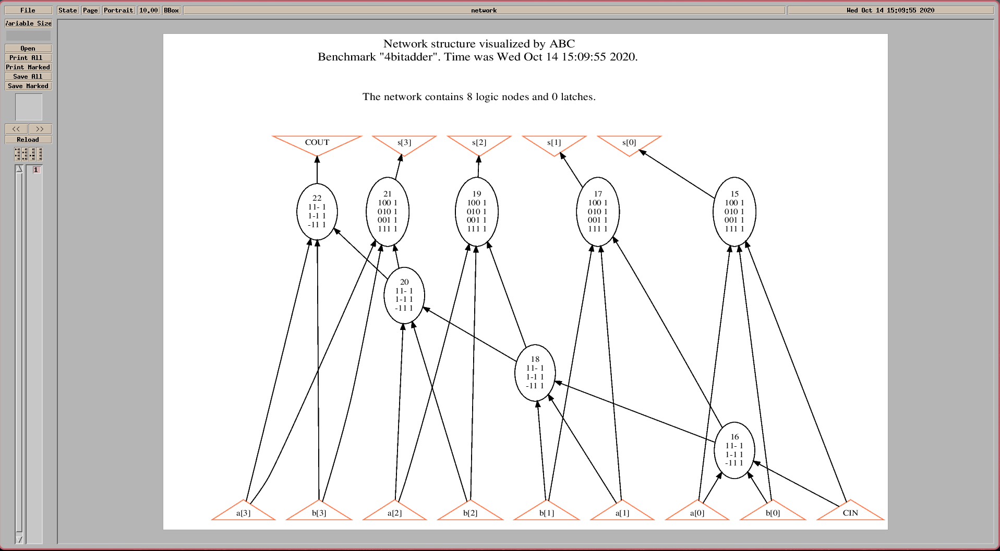
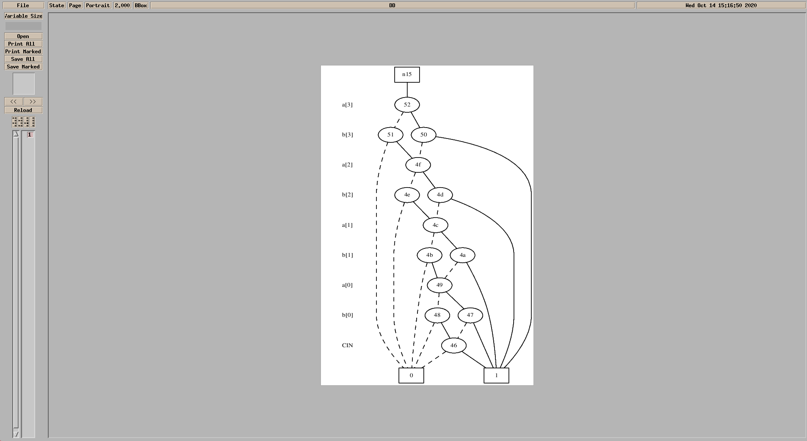

# LSV pa1-1

##  Problem a

- The blif file is called `4bitFullAdder.blif` and is stored in this directory

## Problem b

- The results of `show`:

- The results of `show` after `strash`:

- The results of `show_bdd`:

