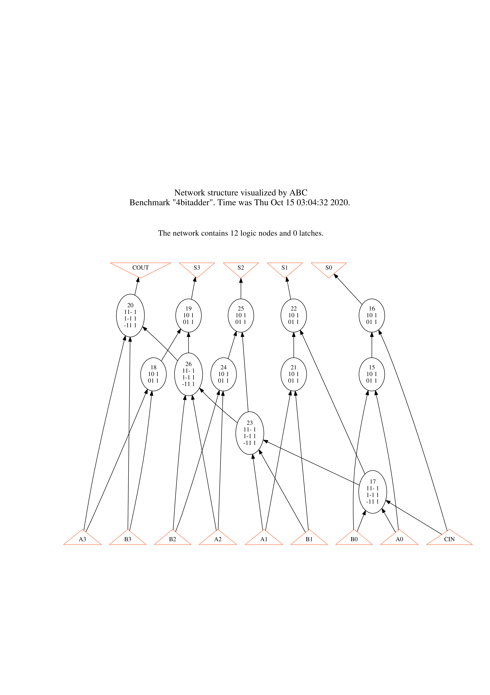
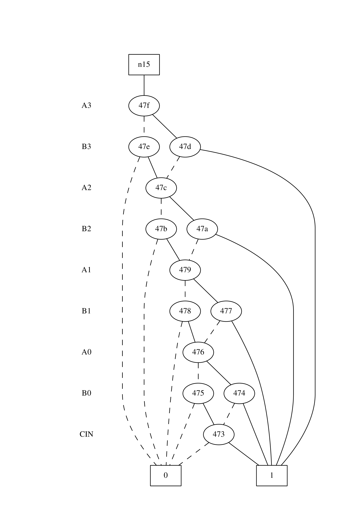

# LSV PA1
## R09943107 陳淳

## Part 1.
### `show`

### `show_bdd`


## Part 2.
### (a) Compare the following differences with the four-bit adder example
Initial `print_stats` on 4bitadder:
```
4bitadder     : i/o =    9/    5  lat =    0  nd =    12  edge =     28  cube =    28  lev = 4
```
#### 1. logic network in AIG (by command `aig`) vs. structurally hashed AIG (by command `strash`)
- `aig`: As the name of the command, it changes the logic network represent method to AIG. But if you use `show` to take a look at the function, you would found that the figure doesn't change.
- `strash`: This command also produced AIG, but it transform the network by one-level structural hashing. Unlike `aig`, the AIG that `strash` produced is represented by 2-input AND gate and its complemented attributes on the edges.

After executing `aig` on 4bitadder, the `print_stats` shows:
```
4bitadder     : i/o =    9/    5  lat =    0  nd =    12  edge =     28  aig  =    40  lev = 4
```
After executing `strash` on 4bitadder, the `print_stats` shows:
```
4bitadder     : i/o =    9/    5  lat =    0  and =     40  lev = 12
```

In `aig`, we can clear see that it has 40 `aig` and 28 `edge`. And in `strash`, we can see that `lev` becomes bigger, and there's no `aig` attributes but 40 `and`.

#### 2. logic network in BDD (by command `bdd`) vs. collapsed BDD (by command `collapse`)
- `bdd`: As the name of the command, it changes the logic network represent method to BDD. But if you use `show` to take a look at the function, you would found that the figure doesn't change.
- `collapse`: Different from `bdd`, though `collapse` also represented the function by BDD in the end, it COLLAPSE the logic network to one-level only. So from CI to CO, it would only has one node in its path.

After executing `bdd` on 4bitadder, the `print_stats` shows:
```
4bitadder     : i/o =    9/    5  lat =    0  nd =    12  edge =     28  bdd  =    32  lev = 4
```
After executing `collapse` on 4bitadder, the `print_stats` shows:
```
4bitadder     : i/o =    9/    5  lat =    0  nd =     5  edge =     33  bdd  =    43  lev = 1
```

We found that `lev` becomes 1 in `collapse`, and it has more `edge` and `bdd` than `bdd`.

### (b) Given a structurally hashed AIG, find a sequence of ABC command(s) to covert it to a logic network with node function expressed in sum-of-products (SOP).
To convert AIG to SOP expressed logic network, we can convert it to strashed AIG first, then we can use `logic` command to produce SOP:
```
strash;
logic;
```
